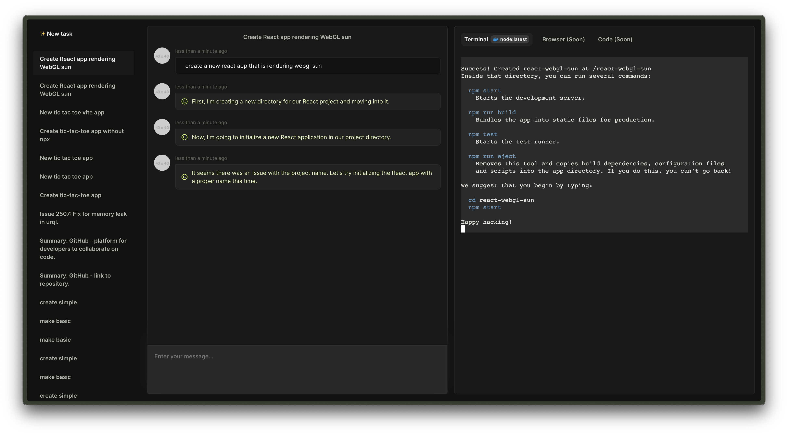

<div align="center">Fully autonomous AI Agent that can perform complicated tasks and projects using terminal, browser, and editor.</div>
</br>

**Discord: https://discord.gg/uMaGSHNjzc**

# Features
- 🔓 Secure. Everything is running in a sandboxed Docker environment.
- 🤖 Autonomous. Automatically detects the next step and performs it.
- 🔍 Built-in browser. Fetches latest information from the web (tutorials, docs, etc.) if needed.
- 📙 Built-in text editor. View all the modified files right in your browser.
- 🧠 All the history commands and outputs are saved in the PostgreSQL database.
- 📦 Automatic Docker-image picker based on the user task.
- 🤳 Self-hosted
- 💅 Modern UI

# Getting started
The simplest way to run Codel is to use a pre-built Docker image. You can find the latest image on the [Github Container Registry](https://github.com/semanser/codel/pkgs/container/codel).


> [!IMPORTANT]
> You need to use a corresponding environment variable in order to use any of the supported language models.

You can run the Docker image with the following command. Remove or change the environment variables according to your needs.
```bash
docker run \
  -e OPEN_AI_KEY=your_open_ai_key \
  -e OPEN_AI_MODEL=gpt-4-0125-preview \
  -e OLLAMA_MODEL=llama2 \
  -p 3000:8080 \
  -v /var/run/docker.sock:/var/run/docker.sock \
  ghcr.io/semanser/codel:latest
```

Alternatively, you can create a `.env` file and run the Docker image with the `--env-file` flag. More information can be found [here](https://docs.docker.com/reference/cli/docker/container/run/#env)

Now you can visit [localhost:3000](localhost:3000) in your browser and start using Codel.

<details>
    <summary>Supported environment variables</summary>

    * `OPEN_AI_KEY` - OpenAI API key. You can get the key [here](https://platform.openai.com/account/api-keys).
    * `OPEN_AI_MODEL` - OpenAI model (default: gpt-4-0125-preview). The list of supported OpenAI models can be found [here](https://pkg.go.dev/github.com/sashabaranov/go-openai#pkg-constants).
    * `OPEN_AI_SERVER_URL` - OpenAI server URL (default: https://api.openai.com/v1). Change this URL if you are using an OpenAI compatible server.
    * `OLLAMA_MODEL` - locally hosted Ollama model (default: https://ollama.com/model). The list of supported Ollama models can be found [here](https://ollama.com/models).
    * `OLLAMA_SERVER_URL` - Ollama server URL (default: https://host.docker.internal:11434). Change this URL if you are using an Ollama compatible server.
    See backend [.env.example](./backend/.env.example) for more details.

</details>

# Development

Check out the [DEVELOPMENT.md](./DEVELOPMENT.md) for more information.

# Roadmap

You can find the project's roadmap [here](https://github.com/semanser/codel/milestones).

# Credits
This project wouldn't be possible without:
- https://arxiv.org/abs/2308.00352
- https://arxiv.org/abs/2403.08299
- https://www.cognition-labs.com/introducing-devin
- https://github.com/go-rod/rod
- https://github.com/semanser/JsonGenius
